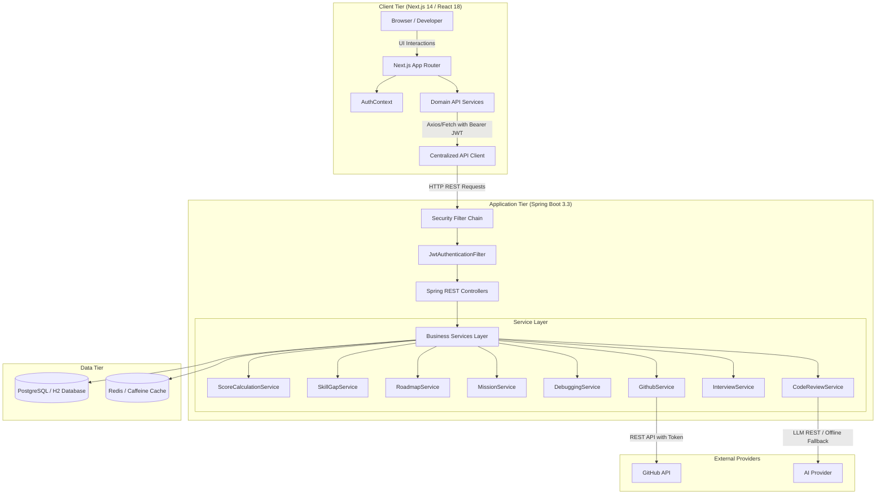
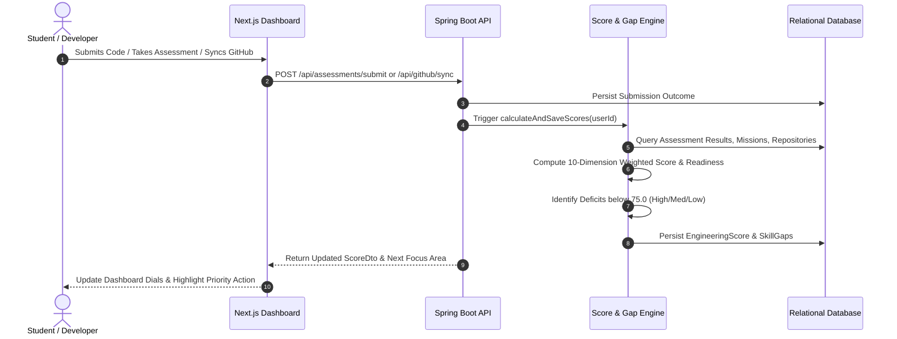

# ForgeAI: System Architecture & Data Flow

This document details the architectural design, security model, and data flow pipelines of ForgeAI.

---

## 1. High-Level System Architecture

---

## 2. Authentication & Security Architecture
- **Stateless Session Management:** Sessions are never stored in server memory (`SessionCreationPolicy.STATELESS`).
- **Cryptographic Signature:** JWT tokens are signed using HMAC-SHA256 (`app.jwt.secret`).
- **Token Claims:** Include subject (`userId`), `email`, `name`, issued date, and 24-hour expiration.
- **Filter Interception:** `JwtAuthenticationFilter` intercepts incoming requests, validates the signature, extracts the subject, and constructs a `UsernamePasswordAuthenticationToken` in `SecurityContextHolder`.
- **CORS Configuration:** Configured to allow Next.js (`http://localhost:3000`) with standard headers and credentials.

---

## 3. The Closed-Loop Engineering Growth Engine
ForgeAI enforces a continuous feedback cycle:

---

## 4. Multi-Language Code Review Architecture
The Code Review subsystem operates under a dual-mode design:
1. **Live LLM Integration:** If `AI_API_KEY` is present, the backend issues an asynchronous REST call to OpenAI or Gemini endpoints.
2. **Offline Heuristic AST Engine:** If unconfigured or in offline viva mode, a built-in static analyzer parses the syntax for:
   - Exception handling containment (`try/catch`).
   - Hardcoded secrets and credential tokens.
   - Dynamic SQL string concatenations (`SQL Injection`).
   - Algorithmic time-space scaling ($O(N^2)$ nested loops).
   - Generates idiomatic refactored code across Java, Python, TypeScript, Go, Rust, C++, and SQL.

---

## 5. Deployment Topology
ForgeAI can be deployed in two configurations:
1. **Local Demonstration Mode:** Default `h2` profile with zero external installation requirements.
2. **Production Containerized Stack:** Managed via `docker-compose.yml` orchestrating:
   - `forgeai-frontend` (Port 3000)
   - `forgeai-backend` (Port 8080)
   - `forgeai-postgres` (Port 5432)
   - `forgeai-redis` (Port 6379)
